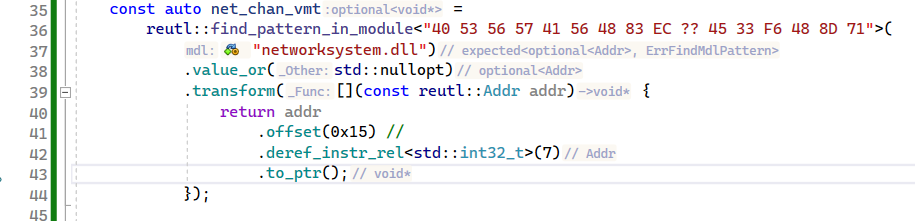

# Reverse engineering utilities library

Aimed only for Amd64 Windows.

Library requires support for c++23, so you can use:

* Visual Studio 17.6 Preview 6 with /std:c++latest
* build the latest Microsoft STL from sources and specify it for msvc
* clang/clang-cl 17.0.0 with Microsoft STL
* probably should work with mingw 13

## Features

* memory signature scanner
* safe vmt hooks (replaces the object's vptr with our vmt)
* hard vmt hooks (replaces original vmt cells)
* memory address class with convenient methods
  like dereferencing from relative jmp/call/lea instructions
  and protection checks: is_executable() is_writable()
* all hooks and vmts will be destroyed automatically
  when unloading you library you may inject and then
  unload your library multiple times without restarting target process

## Todo

* find_pattern_in_module should take modules info from PEB
  rather than from GetModuleHandle and GetModuleInformation
* implement benchmarks for signature scanner
* change scanner searching method from default std searcher to
  std::boyer_moore_searcher or std::boyer_moore_horspool_searcher
* Add github CI

## Usage

Library interfaces intended for use with monadic functions.

```c++
    const auto net_chan_vmt =
        reutl::find_pattern_in_module<"40 53 56 57 41 56 48 83 EC ?? 45 33 F6 48 8D 71">(
            "networksystem.dll")
            .value_or(std::nullopt)
            .transform([](const reutl::Addr addr) {
                return addr
                    .offset(0x15) //
                    .deref_instr_rel<std::int32_t>(7)
                    .to_ptr();
            });
```

This is how it looks with resharper c++ helpers


See the example library for complete usage demonstration.

### Build

#### Visual Studio

Open Visual Studio Developer Command Prompt/Powershell cd to library root
and enter the following commands

```shell
  mkdir build
  cd build
  cmake .. -G "Visual Studio 17 2022" -DBUILD_TESTING=OFF
```

after that open reult.sln in IDE and build reutl with preferred compiler options

#### Ninja Build

```shell
mkdir build
cd build
cmake .. -G Ninja -DBUILD_TESTING=OFF
cmake --build .

# build example
cmake --build . --target nw_hooks
```

If you are use CMake in your project consider installing reutl as a git submodule.

```shell
git submodule add https://github.com/ManulMap/reutl
```

Then include it into your library.

```cmake
cmake_minimum_required(VERSION 3.25)
set(CMAKE_CXX_STANDARD 23)
project(your_project)

add_library(your_lib SHARED dllmain.cc)

add_subdirectory(reutl)
target_link_libraries(your_lib reutl)
```

### Development and testing

In order to build reutl with testing, you need to install the Catch2
testing framework with vcpkg and specify vcpkg toolchain file for cmake

For Visual Studio IDE use **Open Folder** then open CMakeSettings.json
and change **CMake toolchain file** option for your build profiles.

For command line build use -DCMAKE_TOOLCHAIN_FILE option.

```shell
# build with testing (Catch2 must be installed)
mkdir build
cd build
cmake .. -G Ninja -DBUILD_TESTING=ON -DCMAKE_TOOLCHAIN_FILE=PathToYourVcpkgToolchainFile\vcpkg.cmake

# run tests
cd test
ctest --extra-verbose
```